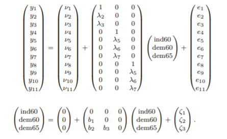
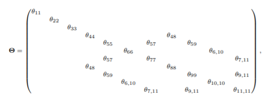
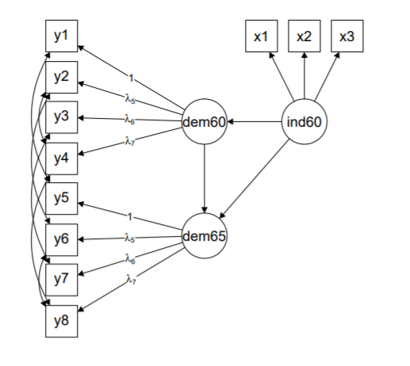
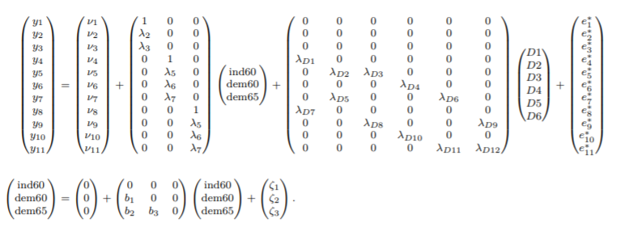
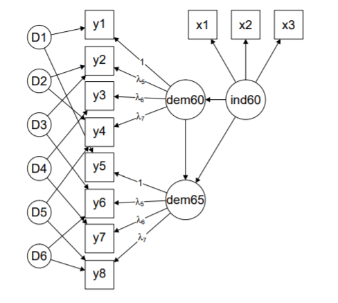

```{r setup, include=FALSE}
knitr::opts_chunk$set(echo = FALSE)
```

## ¿Qué es un SEM Bayesiano?

- Frecuentista vs bayesiano 

- Previa y posterior

## Ventajas sobre los métodos frecuentistas

- Modelos complejos.
- Errores de parámetros.
- Previas informativas.

## `blavaan`

- Estimación de modelos.
- Propuesta de modelos. 
- Sintaxis similar (JAGS).

## Antes de `blavaan`

- Era posible hacer estimaciones bayesianas.
- Previas limitadas: Gamma inversa, Wishart y Normal.

## `lavaan` vs `blavaan`

- `cfa` vs `bcfa`
- `sem` vs `bsem`

## `lavaan` vs `blavaan`

- Definición de la distribución previa.
- **JAGS**
- Valores iniciales para MCMC

## Método de "expansión de parámetros"

- Matrices de covariancias no diagonales.
- Método de "expansión de parámetros".

## Ejemplo

Utilizando el ejemplo de democracia de Bollen (1989), tenemos un modelo con 11 variables observadas que provienen de 3 variables latentes. Este modelo lo podemos expresar de forma matricial como:



## Ejemplo

Además, vamos a asumir que las variables latentes no están correlacionados, pero las variables observadas si, teniendo la siguiente matriz de covariancias, llamada $\Theta$, que se presenta a continuación:



En este caso, la matriz no es diagonal, dado que existen covariancias no nulas entre 6 pares de variables, lo que hace difícil estimar esta matriz de covariancias mediante otros métodos bayesianos.

## Ejemplo

El modelo anterior lo podemos expresar mediante el siguiente diagrama de trayectorias:



Como se puede ver, hay covariancias entre algunas variables observadas, representadas mediante las flechas curvas

## Ejemplo

Utilizando el método de "expansión de parámetros", creamos 6 nuevas variables latentes, que representan las 6 covariancias entre las variables observadas, que se denominan $D_1, ... , D_6$.



Al hacer esto, la nueva matriz de covariancias de las variables observadas, $\Theta^*$, es diagonal, por lo que se puede estimar mediante métodos bayesianos ya conocidos.

## Ejemplo

De esta forma, el modelo de trayectoria con "expansión de parámetros" se vería de la siguiente forma:



## Ejemplo

En general, esta "expansión de parámetros" solamente se realiza en el caso en el que alguna matriz de covariancias no sea diagonal o no tenga restricciones.

## Ajuste del modelo y comparación

El paquete `lavaan` calcula algunas medidas de ajuste y de comparación con otros modelos como, por ejemplo:

- Log-verosimilitud
- DIC (Criterio de Información de Deviancia)
- Factor de Bayes
- Validación cruzada "dejando uno afuera"

## Referencias

- Bollen KA (1989). Structural Equations with Latent Variables. John Wiley & Sons. doi: 10.1002/9781118619179.


