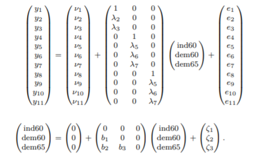
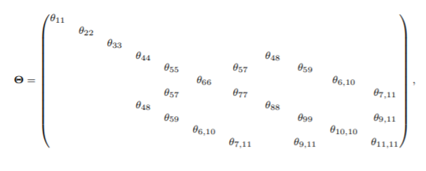
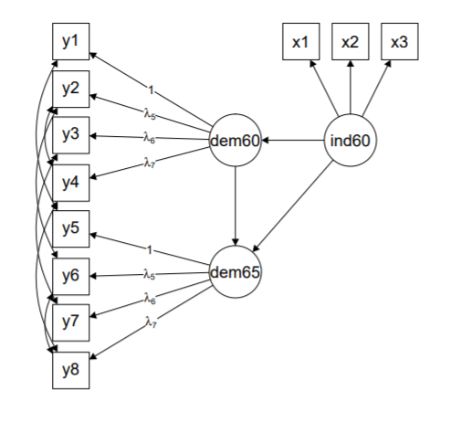
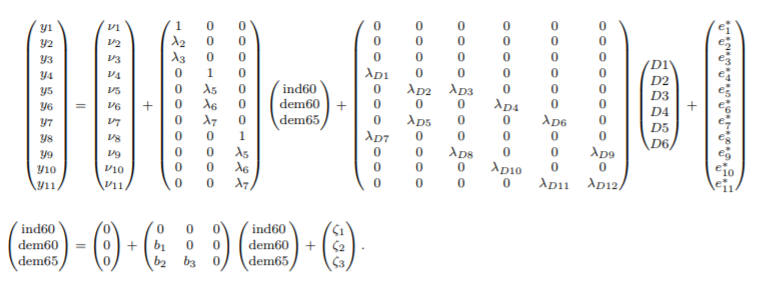
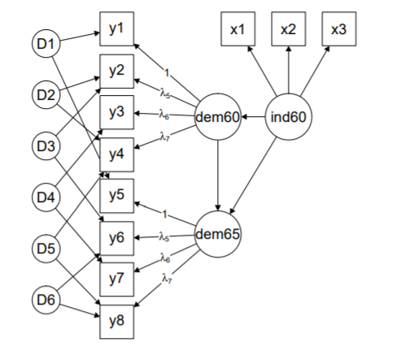

```{r setup, include=FALSE}
knitr::opts_chunk$set(echo = FALSE)
```

## ¿Qué es un SEM Bayesiano?

Un modelo de ecuaciones estructurales bayesiano cambia en que la forma de estimar los parámetros no se hace con el enfoque frecuentista, es decir mediante máxima verosimilitud, sino mediante métodos bayesianos. 

Estos permiten, con base en una distribución a priori (ya sea informativa o no informativa), utilizar los datos recolectados para llegar a una distribución para todos los parámetros a posteriori.

## Ventajas sobre los métodos frecuentistas

- Es más fácil estimar modelos complejos mediante métodos bayesianos (MCMC) que mediante métodos frecuentistas (máxima verosimilitud)
- Las estimaciones de errores de los parámetros no dependen de supuestos asintóticos
- Permite el uso de prioris informativas para poder dar más piezas de información a un modelo subidentificado y evitar valores de variancias y correlaciones que no son posibles

## `blavaan`

Es útil tanto para estimar y analizar modelos como para proponer y hacer estudios metodológicos sobre nuevos tipos de modelos

`blavaan` utiliza sintáxis como la de `lavaan` y, posteriormente, la transforma en comandos que pueden ser leídos mediante **JAGS** para poder hacer el muestreo mediante MCMC de los parámetros del modelo.

## `blavaan`

Antes de `blavaan` era posible realizar estimación de SEM mediante métodos bayesianos, pero estos se reducían normalmente a utilizar solamente algunas distribuciones a priori: gamma inversa para la variancia de los parámetros, Wishart para la matriz de covariancias y normal para los demás parámetros. Esto hace que estimar modelos en los cuales no se tiene evidencia de normalidad, o en los cuales se quieran estimar covariancias residuales, sean dificiles de estimar mediante estos métodos.

## `lavaan` vs `blavaan`

La mayor parte de las funciones de `lavaan` se pueden utilizar de la misma forma en el paquete `blavaan`, solamente que agregando una **b** al frente del nombre de la función.

- Para hacer análisis factorial confirmatorio: `cfa` vs `bcfa`
- Para hacer ecuaciones estructurales: `sem` vs `bsem`

## `lavaan` vs `blavaan`

Comparado con `lavaan`, el paquete `blavaan` tiene algunas nuevas características y funciones:

- Especificación de la distribución a priori
- Uso y exportación de la sintáxis de **JAGS**
- Especificación de valores iniciales para MCMC

## Método de "expansión de parámetros"

Permite estimar modelos en los cuales las matrices de covariancias no son diagonales (es decir, existen covariancias no nulas entre algunas variables)

Para esto, se utiliza un método de "expansión de parámetros", en el cual se definen variables latentes "fantasmas", las cuales funcionan como las covariancias entre las variables, terminando así con una matriz de covariancias diagonal, que es sencilla de estimar.

## Ejemplo

Utilizando el ejemplo de democracia de Bollen (1989), tenemos un modelo con 11 variables observadas que provienen de 3 variables latentes. Este modelo lo podemos expresar de forma matricial como:



## Ejemplo

Además, vamos a asumir que las variables latentes no están correlacionados, pero las variables observadas si, teniendo la siguiente matriz de covariancias, llamada $\Theta$, que se presenta a continuación:



En este caso, la matriz no es diagonal, dado que existen covariancias no nulas entre 6 pares de variables, lo que hace difícil estimar esta matriz de covariancias mediante otros métodos bayesianos.

## Ejemplo

El modelo anterior lo podemos expresar mediante el siguiente diagrama de trayectorias:



Como se puede ver, hay covariancias entre algunas variables observadas, representadas mediante las flechas curvas

## Ejemplo

Utilizando el método de "expansión de parámetros", creamos 6 nuevas variables latentes, que representan las 6 covariancias entre las variables observadas, que se denominan $D_1, ... , D_6$.



Al hacer esto, la nueva matriz de covariancias de las variables observadas, $\Theta^*$, es diagonal, por lo que se puede estimar mediante métodos bayesianos ya conocidos.

## Ejemplo

De esta forma, el modelo de trayectoria con "expansión de parámetros" se vería de la siguiente forma:



## Ejemplo

En general, esta "expansión de parámetros" solamente se realiza en el caso en el que alguna matriz de covariancias no sea diagonal o no tenga restricciones.

## Ajuste del modelo y comparación

El paquete `lavaan` calcula algunas medidas de ajuste y de comparación con otros modelos como, por ejemplo:

- Log-verosimilitud
- DIC (Criterio de Información de Deviancia)
- Factor de Bayes
- Validación cruzada "dejando uno afuera"

## Caso aplicado

Todavía falta esta parte :(

## Referencias

- Bollen KA (1989). Structural Equations with Latent Variables. John Wiley & Sons. doi: 10.1002/9781118619179.


